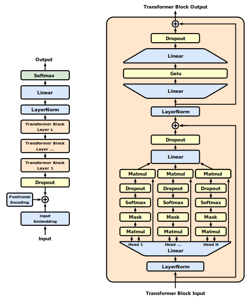

# nanoGPT: Generative Pre-trained Transformer

Generative Pre-trained Transformers (GPTs) are a class of next-word prediction models based on the transformer architecture. This projects reimplements [nanoGPT](https://github.com/karpathy/nanoGPT), a repository to train/finetune medium-sized GPT models.

<p align="center">
  
</p>

## Installing Requirements

Install dependencies from requirements.txt file. Make sure to create a virtual/conda environment before running this command.

```
# create new env called gpt_env
conda create -n gpt_env python=3.11

# activate gpt_env
conda activate gpt_env

# install dependencies
pip install -r requirements.txt
```

## Data

The GPT-2 model is trained on the OpenWebText dataset, an open reproduction of OpenAI's (private) WebText. You can also finetune a pretrained GPT-2 model on the TinyShakespeare dataset, which consists of the works of Shakespeare. The dataset is tokenized using the BPE tokenizer from the tiktoken library. Run the command below to download and tokenize the dataset:

```
# navigate to the datasets folder
cd src/data/datasets

# download openwebtext dataset
python openwebtext/prepare.py

# download shakespeare dataset
python shakespeare/prepare.py
```

This creates a `train.bin` and `val.bin` in that data directory. Once downloaded, update `data_dir` in the config with the absolute path of the folder containing the bin files.

```
# inside train_gpt2.yaml
...
data:
    data_dir: path_to_bin_files
...
```

## Model

The GPT architecture is built by stacking multiple transformer decoder blocks. It uses causal self-attention to capture long-range dependencies and context within input sequences to predict the next token.  The GPT model supports the following methods:

**`model.predict(idx: Tensor, targets=True: Boolean)`**

Takes a conditioning sequence of indices idx (LongTensor of shape (b,t)), returns target prediction for each input token (`targets=True`) or just for the last token (`targets=False`)

**`model.generate(idx: LongTensor, max_new_tokens: Integer, temperature=1.0: Integer, top_k=None: Integer)`**

Takes a conditioning sequence of indices idx (LongTensor of shape (b,t)) and complete the sequence max_new_tokens times, feeding the predictions back into the model each time.

You can initialize the model from pretrained HuggingFace checkpoints. Select any of pretrained models listed in the `config/model` folder by updating the config as follows:

```
├── config/model             
│   ├── gpt2-large.yaml
│   ├── gpt2-medium.yaml
│   ├── gpt2-xl.yaml
│   └── gpt2.yaml


# inside finetune_shakespeare.yaml
defaults:
    - model: gpt2-xl
    - _self_
...
```

## Training and Finetuning

Before running the training script, update the config file based on your hardware (ex. for multi-node training). Most importantly, choose a `batch_size` that maximizes GPU memory and adjust the `grad_accum` parameter to control effective batch size (~0.5M for GPT-2 training). Feel free to change other hyperparameters like learning rate, weight decay, etc. from the config files. The training script `train.py` can be run both on a single gpu, and also in a larger training run with distributed data parallel (ddp).

1. To run on a single GPU, example:
```
python train.py --batch_size=32 --compile=False
```

2. To run with DDP on 4 gpus on 1 node, example:
```
torchrun --standalone --nproc_per_node=4 train.py
```

3. To run with DDP on 4 gpus across 2 nodes, example:
```
# Run on the first (master) node with example IP 123.456.123.456:
torchrun --nproc_per_node=8 --nnodes=2 --node_rank=0 --master_addr=123.456.123.456 --master_port=1234 train.py

# Run on the worker node:
torchrun --nproc_per_node=8 --nnodes=2 --node_rank=1 --master_addr=123.456.123.456 --master_port=1234 train.py

# (If your cluster does not have Infiniband interconnect prepend NCCL_IB_DISABLE=1)
```

4. You can run the finetuning script by switching to the appropriate config file. By default, the model is trained from scratch on the OWT dataset.
```
# finetuning on TinyShakespeare
torchrun --standalone --nproc_per_node=4 train.py --config-path=config --config-name=finetune_shakespeare
```

## To-dos

Any kind of enhancement or contribution is welcomed.

- [ ] Evaluation script
- [ ] Benchmarking script
- [ ] Support for loggers
      
## References

[1] [nanoGPT Repository](https://arxiv.org/abs/1706.03762): nanoGPT github code repository with more information.

[2] [Let's reproduce GPT-2 (124M)](https://www.youtube.com/watch?v=l8pRSuU81PU): Video tutorial building GPT-2 from scratch.

[3] [The Illustrated GPT-2](https://jalammar.github.io/illustrated-gpt2/): Visual explanation of gpt-2 model and attention mechanism.

[4] [GPT-3 Paper](https://arxiv.org/abs/2005.14165): Language Models are Few-Shot Learners


